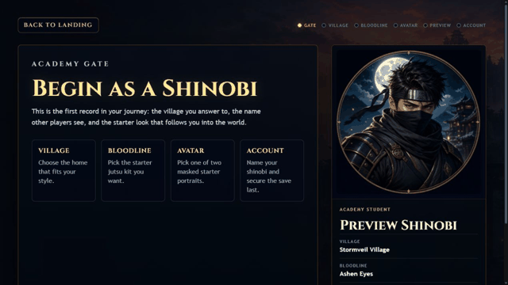
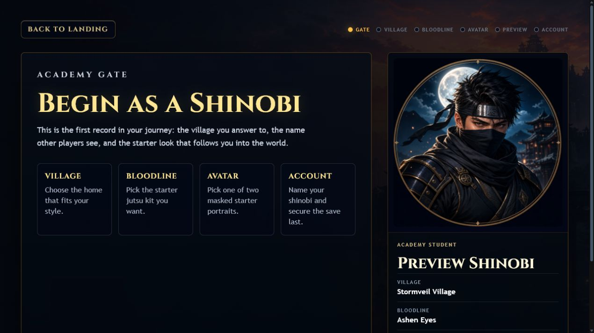
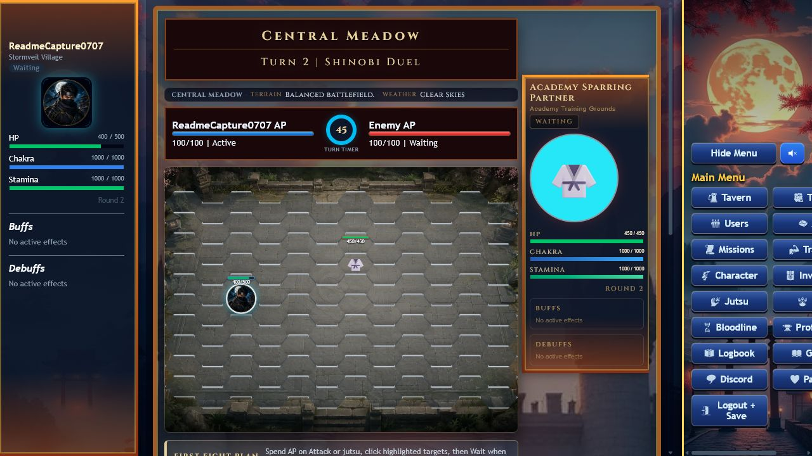

# ShinobiX


ShinobiX is a browser-based ninja MMORPG built around long-term character
growth, jutsu combat, missions, clans, pets, village systems, towers, ranked
PvP, and live-service progression loops.

The playable client currently presents itself as **Shinobi Journey** while the
repository and backend package use the **ShinobiX** name.



## Why Star This Repo

Star ShinobiX if you want to follow a serious live browser MMORPG codebase. The
project is more than a landing page: it
has a real React client, an Express/Supabase backend, server-side reward and
anti-cheat checks, and a broad automated test suite covering combat, missions,
economy, PvP, saves, pets, towers, village systems, and release gates.

## Gameplay

- Create a shinobi with a village, starter bloodline, avatar, jutsu kit, and
  protected save.
- Train stats and jutsu, take missions and hunts, manage inventory, recover at
  the hospital, and build long-term progression through the Logbook.
- Fight with AP-based tactical combat, movement, jutsu, weapons, consumables,
  effects, cooldowns, battle logs, and server-validated reward paths.
- Join social and competitive systems including clans, ranked PvP, pet arena,
  battle towers, card clash, village leadership, and sector-war foundations.
- Operate the live beta safely with emergency controls, audit logs, receipts,
  rate limits, product metrics, and admin diagnostics.

## Screenshots

| Character creation | Tactical combat |
| --- | --- |
|  |  |

## Current Status

ShinobiX is a **live public beta**, not a 1.0 release. Its shipped player systems
include the complete early loop plus PvP and Ranked, Towers and Spire, Hollow
Gate, companions and their battle modes, Chronicle Showdown, clans and Clan Boss
Operations, Village and Sector War, professions, Legacy, Hall of Legends, and
the village story chronicles.

Emergency disable controls remain available for incident response. Admin and
creator operations retain their existing permissions; operational safeguards do
not describe player systems as unlaunched.

All shipped Solo PvE combat modes now seal player loadouts, resolve actions,
recover sessions, and settle rewards on the server. The server rejects the
retired Weekly Boss client-damage and legacy mission-win report paths.

See the canonical [Live Product Status](docs/LIVE_PRODUCT_STATUS.md). The
[Public Beta Launch Recommendation](PUBLIC_BETA_LAUNCH_RECOMMENDATION.md) and
[Feature Flag Release Matrix](FEATURE_FLAG_RELEASE_MATRIX.md) are preserved as
historical rollout evidence.

## Tech Stack

- Backend: Node 22, Express 5, TypeScript, Supabase/Postgres, Socket.IO.
- Client: React 19, Vite 8, TypeScript, Three.js, React Three Fiber.
- Operations: Railway deployment notes, health checks, release flags,
  audit logs, Sentry integration, and build-size checks.
- Testing: Node test runner plus TypeScript/tsx tests across API modules,
  combat engines, economy, PvP, missions, pets, towers, village systems, and
  client libraries.

## Quick Start

Requires Node.js 22 or newer.

```bash
npm ci
npm test
```

Run the lightweight UI/mock client:

```bash
cd shinobij.client
npm ci
npm run dev
```

Vite starts on port `50891` by default (override with `DEV_SERVER_PORT`; HTTPS
when a local development certificate is available):

```text
https://127.0.0.1:50891/
```

This Vite server intentionally implements only a small mock API for UI work. It
is not the authoritative game backend, so deeper missions, PvP, persistence,
training, and settlement routes may be unavailable there.

For a full local gameplay/QA server without a production database, build first,
then start the Express server in guarded in-memory test mode. In PowerShell:

```powershell
npm run build
$env:NODE_ENV = "test"
$env:SHINOBIX_QA_MEMORY_KV = "1"
$env:SESSION_SECRET = "local-qa-session-secret-at-least-32-characters"
$env:ADMIN_PASSWORD = "local-qa-admin-password"
$env:DISABLE_SCHEDULED_JOBS = "1"
$env:DISABLE_SNAPSHOT_CRON = "1"
node dist/server.js
```

Open `http://127.0.0.1:3000/`. The in-memory backend refuses to start unless
`NODE_ENV=test`, so it cannot be reached in production; persistent production
operation still requires the database variables documented in `.env.example`.

Build everything:

```bash
npm run build
```

The full build compiles the server, builds the client, verifies the deployment
bundle, and runs the build-size check.

## Project Layout

- `server.ts` - the Express entry point. It imports every `api/**` handler and
  registers each one explicitly, then serves the client build on the same port.
  There is no folder-convention routing: an unregistered handler is unreachable.
- `api/` - gameplay APIs, combat systems, storage, auth, rewards, telemetry,
  realtime helpers, and beta hardening. Underscore-prefixed files here are
  shared helpers, not routes.
- `shared/` - code used by both the server and the client.
- `shinobij.client/` - Vite/React game client.
- `supabase-migrations/` - SQL migrations for the Postgres schema.
- `scripts/` - catalog validation, asset helpers, release checks, simulations,
  and build tooling.
- `release-audit/` - standalone release verification programs.
- `tools/` - developer utilities.
- `docs/` - architecture plans, release audits, balance notes, and roadmap.

`dist/` is generated, gitignored, and deliberately not committed - Railway
rebuilds it from source on every deploy.

## Roadmap

The public roadmap is in [docs/ROADMAP.md](docs/ROADMAP.md). Current work focuses
on coherence, player guidance, safety, observability, and live-beta polish.

## Release Notes

Historical draft notes for the first beta are in
[docs/RELEASE_NOTES_v0.1.0-beta.md](docs/RELEASE_NOTES_v0.1.0-beta.md).

## Media Kit

Repository screenshots and capture notes live in
[docs/MEDIA_KIT.md](docs/MEDIA_KIT.md). The current README GIF is generated
from verified local screenshots so visitors see real app screens instead of
stock art.

## Security

Please report vulnerabilities **privately**, not in a public issue: use
[private vulnerability reporting](https://github.com/Timehue/ShinobiX/security/advisories/new).
The full policy - what is in scope, what is not, and the rules that keep testing
away from other players' saves - is in
[.github/SECURITY.md](.github/SECURITY.md).

This is a live game with real player accounts, so please read the testing rules
before probing anything.

## Contributing

ShinobiX is a solo-maintained live project rather than an open contribution
model, so there is no roadmap commitment on outside pull requests. Bug reports
are genuinely useful and welcome - open an issue with what you did, what
happened, and what you expected. Anything security-related goes through the
private channel above instead.

Two conventions matter if you do run the code locally: the root `npm test` is
Node's test runner and never opens a browser, and any change to a screen or
component also needs the Playwright suites in `shinobij.client/`. Both are
described in [CLAUDE.md](CLAUDE.md).

## Community

- Discord: https://discord.gg/bCQGs8r6SK
- Roadmap: [docs/ROADMAP.md](docs/ROADMAP.md)
- Release readiness: [RELEASE_CHECKLIST.md](RELEASE_CHECKLIST.md)

## License

No open-source license is declared for this repository. All code and assets are
under exclusive copyright and may not be redistributed or reused without
permission. The source is public to read, not to reuse.
