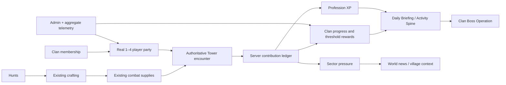

# SHINOBIX MMO Roundness Audit

Audit date: 2026-08-05

Product repository baseline: `0960a192cfc383bd05a6c6d004c88b12b2754384`

Behavioral reference: `theninjarpg/theninjarpg` at `df6dcd0d7d4b23d9cf309ea3a0159f366f764869` (read-only; no copied code, prose, assets, or schemas)

## Executive finding

SHINOBIX already has unusually broad MMO surface area and strong server authority. Its largest quality gap is not missing combat content: it is the absence of a reliable connective layer that tells a player what matters, assembles real people around a shared objective, and carries the result back into clan, profession, economy, world, and live-operations state.

The highest-leverage vertical slice is therefore a **Clan Boss Operation**, not a new combat mode. It reuses the existing N-actor Tower encounter and four authored boss mechanics, then adds a truthful 1–4 player party lifecycle, server-sealed readiness, reconnect/recovery, contribution-aware settlement, a four-horizon activity spine, sector pressure, profession/crafting value, bounded tactical communication, aggregate telemetry, and admin recovery. The slice joins systems that already exist without inventing a currency, schema, combat engine, or power ladder.

## Method and evidence labels

The audit inspected executable API handlers, shared math/contracts, client entry points, tests, release/runbook documents, generated design/economy reports, and the exact reference commit above. Findings use these labels:

- **Implemented** — executable and reachable in the current product.
- **Partial** — an executable foundation exists, but a required lifecycle or connection is missing.
- **Documented only** — described in product documentation without a complete reachable implementation.
- **Placeholder** — surfaced to a player or operator but does not represent the promised behavior.
- **Intentionally separate** — a deliberate product boundary, not a gap to merge away.

The reference repository was used only to observe behavioral patterns: explicit raid queue records, human membership, ready/start claims, scoped raid chat, persistent raid HP and threshold rewards, sector-linked raid activation, rollback cleanup, and idempotent participation updates. SHINOBIX keeps its own architecture, vocabulary, art, balance, and implementations.

## Current architecture guardrails

- React 19/Vite SPA; Express API; Supabase-backed storage; single Railway replica is the accepted multiplayer ADR.
- Player identity is token-first; the server owns rewards, inventory consumption, combat actions, party membership, eligibility, and settlement.
- Save/KV mutations require locks and idempotency receipts. No database migration is approved for this pass.
- PvP and Solo PvE share the canonical ordinary combat truth. Tower is the intentional N-actor engine. Hollow Gate remains normal PvE.
- Adaptive shell breakpoints are canonical: `xs <560`, `sm 560–979`, `md 980–1179`, `lg 1180–1399`, `xl 1400–2199`, `xxl >=2200`. Fixed battle canvases own their internal geometry; the shell must not transform-scale them.
- Product analytics is privacy-preserving, aggregate, allowlisted, and optional. No player names, clan names, chat text, free-form failure text, or loadout details belong in analytics.

## System graph

| System | Entry point / audience | Loop and cadence | Authority | Inputs → outputs | Connections today | Resilience / ops | Evidence | Roundness finding |
|---|---|---|---|---|---|---|---|---|
| Academy and onboarding | Login, village; levels 1–13 | Guided one-time steps | Mixed: server saves, client orchestration | starter state → training, jutsu, gear, first mission | Logbook and Daily Briefing point into it | Save versioning; client recovery paths | Implemented | Strong early spine; guidance thins sharply after exams. |
| Training and jutsu | Training halls; all levels | Timed/offline progression | Server settlement with client presentation | time/ryo → stats, techniques, loadouts | Exams, missions, all combat | Established receipts and tests | Implemented | Mature; should be recommended, not duplicated. |
| Missions and hunts | Mission Hall; broad level bands | Session/daily progression | Server claim and reward settlement | eligibility/time/combat → XP, ryo, hunt materials | Crafting, Logbook, Daily Briefing | Claim guard, authoritative balances | Implemented | Healthy faucet and onboarding bridge. Hunt materials are an under-explained operation supply input. |
| Solo PvE | Missions, ANBU, bosses | On demand | Canonical server combat adapters | sealed loadout → combat result/rewards | Story, professions, economy | Durable replay and idempotent settlement | Implemented | Do not replace with Tower or a new engine. |
| Hollow Gate | Dedicated PvE entry | Run-based | Server authoritative | gated loadout → PvE rewards | Progression and economy | Replay-safe settlement | Intentionally separate | Keep as normal PvE; no operation retrofit. |
| Battle Towers / Spire | Tower lobby | Run-based N-actor | Server session/action/consumption | sealed squad → multi-actor encounter/reward | Clan Boss already wraps a reserved floor | Durable sessions, invite lookup, AFK pass, item receipts | Implemented | Correct reusable combat substrate for a group operation; not ordinary-combat truth. |
| Weekly Boss | Central Hub | Weekly solo/group-adjacent score event | Server authoritative | attempt → boss result/rewards | Leaderboards and hub | Feature/reward gates, tests | Implemented | Functional, but visually/structurally adjacent to other menus rather than an activity-spine destination. |
| Clan Boss Gauntlet | Clan Hall | Five attempts/member/week | Server pool, Tower session, settlement | chosen clanmate names → shared HP, clan score, personal/clan points | Clan, Tower, standings | Request receipts, progress lock, session invite, item settlement | Partial | Best vertical target. Current selector creates unaccepted “human” actors and auto-passes absent players; no lobby, ready, transfer, finder, truthful presence, contribution ledger, world/profession connection, or admin recovery. |
| Casual / ranked PvP | Arena | On demand / seasonal | Server authoritative | queue/match → rating, rewards, honor | Professions, leaderboards, war | Existing queue/session protections | Implemented | Do not disturb balanced PvP with operation power rewards. |
| Clans | Clan Hall | Persistent social/progression | Server validation and locked awards | membership/activity → points, hall, treasury | War, missions, Clan Boss | Treasury anti-mint validation; audit paths | Implemented | Rich destination, but Clan Boss party state is not a clan-owned social object yet. |
| Village / sectors / war | World map and village | Persistent and timed | Server world state | travel, supply, combat → control/war state | ANBU, missions, world news | Canonical sector records; runbooks | Implemented | Strong world layer. Clan Boss has no location or bounded shared-world consequence. |
| Professions | Profession hubs; level 13+ | Long-term rank/mastery | Server endpoints plus several legacy client surfaces | profession action → XP/rank/perks | Healer, Vanguard, Pet Tamer specialties | Caps/anti-abuse tests vary by source | Partial | Identity exists, but there is no shared high-value operation where damage, support, objective play, and survival all matter. |
| Crafting / supplies | Crafter | Material conversion | Server forge settlement | hunt materials/ryo → pills, bombs, potions, equipment | Hunts and combat item consumption | Server debit and Tower settlement | Implemented | Complete loop exists mechanically; its reason-to-craft is weakly signposted. Operations can consume existing supplies without adding currency. |
| Pets | Pet hubs and encounters | Collection/training/duels | Mixed by submode, server rewards | exploration/training → companions/perks | World, profession, PvE | Dedicated tests and assets | Intentionally separate | World canon connection is sufficient; do not force pet combat into Clan Boss. |
| Chronicle / cards | Chronicle hub | Collection and duels | Dedicated card runtime | cards → deck/duel progression | Story/world framing | Dedicated tests/assets | Intentionally separate | A separate game expression; cohesion should come through activity guidance and lore, not engine convergence. |
| Daily Briefing | Login modal | Per session/day | Server rewards; client recommendation rules | save + caches → next-step cards/news | Training, missions, mail, war, Logbook | Graceful cache fallback | Partial | Valuable shell, but recommendations are client-derived, mostly “now,” and lack explicit Today / This Week / Long Term horizons and server eligibility reasons. |
| Logbook | Profile/navigation | Long-term checklist | Client projection of saved state | milestones → completion cues | Academy/exams | Local deterministic state | Partial | Strong early checklist; insufficient endgame and returner reorientation. |
| Chat / presence | Village chat, social surfaces | Real time/polling | Server channels | authenticated messages → social coordination | Villages and combat-adjacent UI | Moderation/admin paths | Partial | No operation-scoped, bounded communication or reliable party presence contract. |
| Economy / wallet | Shop, bank, rewards, crafting | Persistent | Server authoritative for material value | faucets → currencies/items → sinks | Nearly all progression | Economy audit generator and anti-mint tests | Partial | Broad but cognitively fragmented. Generated export reports 11 value types; several appear one-sided and require authoritative reconciliation before balance changes. |
| Admin / live operations | Admin panels and runbooks | On demand / incidents | Full-admin endpoints | aggregate diagnostics + explicit action → recovery | Flags, audit, metrics | Rate limits, audit records, rollback/restore docs | Implemented | Clan Boss exposes state but lacks party/operation inspection and safe stuck-lobby recovery. |
| Telemetry | Server aggregate metrics, optional product analytics | Continuous/daily | Server allowlists | categorical events → aggregate reports | Beta certification and ops | Privacy allowlists; disabled-by-default client analytics | Implemented | Needs operation funnel and recovery signals, never identities or free-form content. |

## Connection map

Solid arrows above represent existing or selected-slice executable connections. The audit found no need for a new currency, inventory system, chat service, database, combat runtime, or world map.

## Evidence matrix

| Claim | Evidence | Label | Gap / decision |
|---|---|---|---|
| Clan Boss damage is server-computed and banked exactly once. | `api/clan-boss/assault-settle.ts`, `api/clan-boss/_assault.ts`, `api/clan-boss/_storage.ts` | Implemented | Preserve. Extend receipts rather than trusting client contribution. |
| Clan Boss reuses an authored N-actor encounter with enrage, summon, regen, or bulwark. | Reserved floors 9001–9004 in Tower floor catalog; content consistency tests | Implemented | The boss is already more than a health sponge. No combat rewrite. |
| A “party” currently represents accepted, ready, online people. | Client sends selected names; start loads their saves and marks all as `ai:false`; absent actors AFK-pass after 75 seconds. | Placeholder | Replace with server-owned membership, acceptance, ready state, presence, leader transfer, and honest fallback. Never label an absent player as AI. |
| The operation supports 1–4 players. | Current maximum is host + two, `CB_MAX_PARTY = 3`. | Partial | Increase through the party contract to 4; keep server encounter scaling. |
| Browser refresh can recover an active assault. | Tower invite lookup includes host and party; session is durable for its TTL. | Partial | Good combat recovery, but no durable pre-start lobby or completion summary. |
| Personal Clan Boss merit recognizes support and objectives. | Current weekly personal damage is equal-split per party and top-five damage earns shards. | Placeholder | Replace new-run ranking inputs with server-derived composite thresholds. Maintain legacy fallback for old records. |
| Professions matter in shared PvE. | Profession identity/perks exist; Clan Boss settlement awards clan points only. | Partial | Add bounded, idempotent operation XP derived from contribution categories. No PvP power reward. |
| Crafted supplies feed the operation. | Hunt materials become craft points; forge creates combat consumables; Tower charges and settles equipped item usage. | Implemented | Surface this existing loop in activity guidance and operation readiness. |
| Clan Boss affects the world. | Weekly boss is global by ID but each clan pool has no sector/location consequence. | Documented only | Add a bounded global weekly sector-pressure projection; cosmetic/contextual impact only. |
| Activity guidance covers four horizons. | Daily Briefing has recommendations and Logbook has Academy milestones, but no canonical server projection by horizon. | Partial | Add server-derived Now / Today / This Week / Long Term items with eligibility and blockers. |
| Operations have scoped communication. | Village chat exists; Clan Boss has none. | Partial | Add predefined tactical pings only. This avoids a new moderation surface. |
| Operators can diagnose and recover a stuck operation. | Generic diagnostics and audit infrastructure exist. | Partial | Add aggregate party/session mismatches and a version-checked, reasoned disband/recovery action. |
| Operation analytics is privacy-safe. | Existing beta metrics and product event allowlists are aggregate/categorical. | Implemented foundation | Add funnel events with size/status/wait buckets only. |
| Currency graph is fully round. | Generated economy export finds 88 faucets, 149 sinks, 126 shop items, but several value types appear one-sided. | Partial | Reconcile generator coverage with executable modes before any removal or balance mutation. Not part of selected vertical. |

## Menu islands and dead-end loops

1. **Clan Boss party selection** is the clearest placeholder. It looks social but requires no invitation, consent, readiness, or live presence. The resulting offline auto-pass is mechanically safe but socially misleading.
2. **Daily Briefing → endgame** is a weak edge. The modal contains useful data, yet it cannot explain commitment, eligibility, a weekly group goal, or a long-term mastery objective in one coherent view.
3. **Profession identity → shared play** is a dead-end loop for many players. Profession pages explain identity, but the weekly cooperative destination does not recognize healing, shielding, control/objectives, or survival.
4. **Hunt material → crafted supply → meaningful preparation** works in code but is poorly narrated. Players can create combat items that the operation already consumes authoritatively; the product rarely closes that loop in guidance.
5. **Clan Boss → world** stops at a global boss name and leaderboard. The event has no sector identity, shared pressure, ambient consequence, or world-news closure.
6. **Operation failure → operator action** is opaque. A stuck/missing session can be inferred from raw KV state, but the admin has no bounded purpose-built view or safe recovery operation.
7. **Economy naming and source/sink comprehension** is fragmented. Eleven value types are legitimate only if each has a crisp purpose and visible path; generated gaps must be reconciled before changing balance.

## Prioritized backlog

Scores are 0–5 and use this weighted formula: player impact 30%, cross-system leverage 25%, risk reduction 20%, implementation confidence 15%, operating value 10%.

| Rank | Candidate | Impact | Leverage | Risk reduction | Confidence | Ops value | Weighted | Decision |
|---:|---|---:|---:|---:|---:|---:|---:|---|
| 1 | Clan Boss Operation vertical: party + contribution + sector + profession + recovery | 5.0 | 5.0 | 4.5 | 4.2 | 4.8 | **4.76** | Selected. Uses authoritative Tower substrate and touches every requested cohesion layer. |
| 2 | Four-horizon Activity Spine in Daily Briefing | 4.8 | 4.8 | 4.0 | 4.5 | 3.8 | **4.46** | Included in selected vertical because it is the operation entry/re-entry contract. |
| 3 | Economy glossary and generated-model reconciliation | 4.0 | 4.0 | 4.2 | 3.8 | 4.0 | **4.00** | Document and instrument first; defer balance changes. |
| 4 | Ranked/social season wrapper improvements | 3.8 | 3.5 | 3.5 | 3.6 | 3.6 | **3.62** | Valuable, but risks touching balanced PvP and connects fewer systems. |
| 5 | Extend Logbook into a complete endgame checklist | 3.6 | 3.7 | 3.0 | 4.2 | 2.6 | **3.51** | Activity Spine provides a safer first step; revisit after recommendation data. |
| 6 | Consolidate intentionally separate combat runtimes | 2.0 | 3.0 | 1.5 | 1.0 | 1.5 | **1.88** | Rejected. Existing authority map explicitly preserves ordinary combat vs N-actor Tower boundaries. |

## Selected vertical slice and acceptance contract

**Player promise:** “See the weekly threat, form a real clan squad, prepare from existing supplies, fight the authored boss, receive credit for the way you helped, change a visible sector state, and know what to do next—even after refresh, disconnect, timeout, or a low-population queue.”

The slice is complete only when all of these are executable:

1. Daily Briefing receives a server-derived activity spine with **Now, Today, This Week, Long Term**, level/returner-sensitive eligibility, commitment, reason, blocker, and direct destination.
2. A clan member creates a public or private 1–4 player party. Other humans explicitly join/accept; membership and leadership live on the server.
3. Ready seals a loadout/version snapshot. Any relevant save change invalidates readiness. Start is leader-only, version-checked, idempotent, and requires all present members ready.
4. Public same-clan finder is honest about population. After a bounded wait, a lone player may choose/follow an explicit solo fallback; no fake players or AI replacements appear.
5. Leave, kick, transfer, decline, cancel, timeout, leader loss, reconnect, refresh, duplicate request, and missing session each have deterministic behavior.
6. Combat remains the existing Tower session/action loop and authored Clan Boss floor. Player action/reward authority remains server-side.
7. Settlement derives per-actor contribution from state deltas, caps categories, rewards meaningful damage/support/objective/survival, and marks AFK/no-action participation separately. Delayed environmental damage may remain unattributed and must be documented.
8. Existing consumable settlement closes the hunt → craft → supply → operation loop. The operation introduces no new currency.
9. Bounded profession XP is awarded idempotently from contribution categories, never from a client claim and never as a ranked-PvP advantage.
10. Each boss has a canonical existing sector. Successful runs reduce a capped weekly pressure value; this is contextual/world progress, not territory ownership or power.
11. Predefined tactical pings provide operation communication without adding user-authored text or a moderation surface.
12. Operators can see aggregate lobby/run health and recover a stuck pre-start party with confirmation, reason, expected version, rate limit, and audit record. They cannot mint player value.
13. Aggregate telemetry covers recommendation view, party create/join/ready, queue wait bucket, start, reconnect, abandon, completion, settlement retry, and recovery. No identity or free-form text is emitted.
14. The UI provides explicit loading, empty, offline, stale, error, reconnecting, ready, starting, active, completed, expired, and disbanded states with 44px touch targets and keyboard/screen-reader semantics.

## Failure model and recovery decisions

| Failure | Required behavior |
|---|---|
| Duplicate mutation request | Replay the stored response for the same request/fingerprint; reject request-ID reuse with a different fingerprint. |
| Simultaneous join / ready / start | Lock the party record and require `expectedVersion`; return current projection on conflict. |
| Leader leaves before start | Transfer to the longest-present eligible member; disband if none remain. |
| Member becomes stale | Show disconnected/stale honestly. Do not replace them. Leader may remove before start; combat keeps the existing AFK pass once a real accepted member started. |
| Save changes after ready | Clear readiness at revalidation and explain that the loadout changed. |
| Browser refresh | Player index resolves party; active operation resolves Tower invite/run; render recovery CTA. |
| Low population | Public finder waits a bounded interval, reports real party/player counts, then exposes explicit solo fallback. |
| Party marked active but Tower session absent | Surface recoverable mismatch to client/admin; never consume a second attempt automatically. |
| Settlement partially fails | Damage banking, item consumption, clan points, profession XP, pressure, and announcements each use stable receipts and can heal on retry. |
| Analytics unavailable | Gameplay continues; aggregate event recording is best effort. |
| Feature rollback | `DISABLE_CLAN_BOSS_PARTIES=1` returns the existing server-authoritative solo start path; no client-chosen offline allies. Existing Clan Boss kill switch remains available. |

## Economy and reward contract

- Reuse existing ryo, clan points, Fate Shards, profession XP, hunt materials, craft points, and combat items. Add no currency.
- Keep top-clan treasury rewards as the existing weekly competition until balance sign-off says otherwise.
- Replace new-run personal top-damage ranking input with contribution thresholds so support is not zero-sum and a damage carry cannot exclude useful teammates. Legacy assaults retain deterministic equal-split fallback.
- Cap action-count contribution and require meaningful category activity so repeated waits/basic spam cannot farm rewards.
- Award no direct combat stat, ranked rating, exclusive best-in-slot power, or territory control from the operation.
- The generated economy model currently reports these unresolved one-sided exports: aura stones, mythic seals, and Hollow Shards with no exported faucets; aura dust, territory-control scrolls, and stat points with no exported sinks. Treat this as an audit lead, not permission to alter live balance, because generator coverage may exclude valid modes.

## Accessibility and adaptive-layout contract

- Lobby and activity cards use normal document flow inside the adaptive shell; the Tower fight keeps its own fixed battlefield geometry.
- At `sm` and below, party members, readiness, finder controls, and horizons become a single-column touch scroller above the fixed bottom navigation clearance.
- At `md` and above, activity horizons may form two columns and lobby roster/status may sit beside preparation/context; no content becomes hover-only.
- All actions are real buttons; toggle state uses `aria-pressed`; progress uses semantic labels; status changes use a restrained live region; focus returns to the triggering action when dialogs/panels close.
- No color-only ready/presence/contribution signal. Motion respects reduced-motion tokens. Existing portrait assets and design tokens are reused.

## Observability and admin contract

Minimum operation dashboard fields: active parties by status, public queued parties, oldest forming/starting age bucket, active assaults, parties with missing Tower sessions, stale member count, settle retry count, completion count, abandon count, median/95th wait buckets, solo-fallback share, contribution-category distribution, and feature flag state.

The only recovery mutation in scope is a pre-start stuck-party recovery/disband. It requires full admin, a canonical reason code, explicit confirmation, expected party version, rate limiting, and an audit record. It releases indices/invites and preserves receipts. It does not edit HP, attempts, rewards, saves, inventories, or leaderboards.

## Test strategy

- Pure transition tests for create/join/invite/accept/decline/leave/kick/transfer/ready/invalidation/queue/fallback/timeout/replay/version conflict.
- Server-handler authority tests for auth, clan boundary, leader permissions, maximum size, readiness snapshot, start replay, session mismatch, and kill switches.
- Contribution unit tests for damage, healing, shielding, cleanse, objective/control, action cap, survival, AFK, and legacy fallback.
- Settlement fault-injection tests for each receipt-bearing side effect and replay.
- Activity-spine matrix tests for levels `1–15`, `15–30`, `30–50`, `50–80`, `80–100`, cap, clan/no-clan, profession/no-profession, hospitalized, and returner.
- Client structure tests for four horizons, honest presence copy, semantic controls, 44px targets, and canonical breakpoints.
- Existing root test suite, client lint/build, focused end-to-end happy path, refresh/reconnect path, low-pop solo fallback, and admin recovery smoke test.

## Delivery and rollback slices

1. **Audit commit** — this document only.
2. **Party/runtime commit** — shared contract, server transitions/handler, contribution projection, tests; inert behind `DISABLE_CLAN_BOSS_PARTIES` rollback.
3. **Activity/world/reward commit** — server activity spine, sector pressure, profession settlement, telemetry/admin, tests.
4. **Client cohesion commit** — Daily Briefing activity spine, real lobby/operation comms, adaptive styles, admin view, accessibility tests.
5. **Certification commit** — final evidence, executed gates, known issues, scorecard, commit/report updates.

Rollback never requires deleting state: disable the new party path, keep existing active Tower sessions settleable, fall back to truthful solo starts, and retain versioned party records until TTL expiry for audit/recovery.

## Intentional non-changes requiring owner decision

- No rewrite or consolidation of PvP, Solo PvE, Tower, Pet Duel, or Chronicle combat engines.
- Hollow Gate remains normal PvE.
- No database or multiplayer-backend migration; the accepted single-replica KV/Socket/Express architecture remains.
- No new currency, auction system, global chat, voice chat, free-form operation chat, guild-vs-guild rules, or territory ownership mutation.
- No balance change to weekly clan podium treasury payouts without economy owner sign-off.
- No deletion/merger of apparently one-sided currencies until the economy generator is reconciled with executable sources and sinks.
- No AI or offline player may be presented as a human party member. Existing combat AFK pass remains only as a timeout rule for a real accepted participant who began the encounter.
- No copy, art, schema, or code is imported from the behavioral reference repository.

## Baseline verification note

The first workspace `npm test` run timed out. The second completed in 336 seconds with **4,918 passing and 11 failing of 4,929**. All 11 failures were client test files that failed at file startup while the workspace client dependency install was blocked by a pre-existing Vite preview process holding the native Rolldown binding. A separate clean checkout accepted the locked client dependency graph; client lint/build results are recorded in the implementation report. Baseline infrastructure/dependency failures are not classified as feature regressions, and final certification must rerun the complete suite from an isolated installed checkout if the workspace lock remains.
