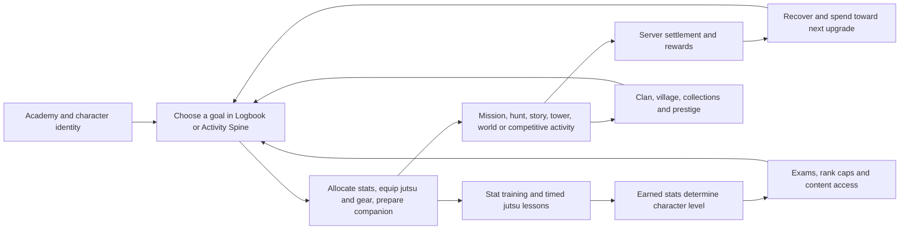

# Gameplay loop audit and comparative research

Date: 2026-09-29. Status: completed research; recommendations are **proposals**, not approved design changes.

Follow-up decision: retain the current training cadence and ranked format; implement reward clarity, the Academy handoff, and earlier progression-commitment explanations. See the [implementation and validation record](gameplay-guidance-implementation-2026-09-29.md). The remaining proposals below are historical audit recommendations, not implementation instructions.

The strongest improvement opportunity is to make every session produce a clearly understood step toward a chosen shinobi identity. Shinobi Journey already has substantial content, tactical systems, progression protection and recovery infrastructure. Its main design risk is the number of separate obligations and reward rules a player must understand to use that content well.

I would prioritize reward clarity, a stronger post-Academy handoff, an honest training cadence, and competitive fairness before adding another major mode.

## Scope and evidence

Baseline: working tree based on `aec3cc862b0234ce804beb878b3e92687a431545`, with substantial pre-existing local changes, including combat, navigation and tournament work. Findings describe inspected files, not a claim that this exact tree is deployed. No gameplay code, player data, economy settings or accepted design rules were changed by this audit.

This is a full-loop **design and implementation review**, with focused executable verification. It is not an exhaustive security audit, fresh human playtest, production balance certification or evaluation of every item/species/encounter. No authenticated production account, production analytics, physical phone or live multiplayer cohort was used. Existing screenshots and older test reports were not counted as new observations.

Authority: [Live Product Status](../LIVE_PRODUCT_STATUS.md), current executable rules, and the repository conventions in [CLAUDE.md](../../CLAUDE.md). Older plans provide context, not current numeric truth. `_Context.md` and `PROJECT_STATE.md` were not introduced; this dated report does not change canonical product status or the roadmap.

Evidence types used below:

- **Verified:** source/configuration and, where stated, tests or deterministic probes.
- **Inference:** likely player-experience consequence; not a measured retention result.
- **Proposal:** suggested change requiring separate implementation and balance decisions.
- Classifications follow the runtime-audit method: Matches design, Design ambiguity, Implementation drift, Config drift, Unspecified runtime behavior, or Validation gap. A design concern can match current intent; it need not be a bug.

## The implemented loop

| Layer | Current behavior and strengths | Main audit question |
|---|---|---|
| First session | Companion-led Academy teaches actual training, equipment, combat, recovery, claim and travel actions; one-time progression floors support graduation at Level 10 | Does the player experience the tactical hook early enough and know what to pursue after graduation? |
| Encounter | AP, positioning, jutsu costs, cooldowns, effects, weapons and consumables; server resolves actions | Can a player explain the important decision and the reason they won or lost? |
| Session | Missions, field exploration, hunts and recovery; training can accrue in the background | Does the next activity still offer something the player wants after capped growth is exhausted? |
| Daily growth | Training, a shared combat-growth budget, hunt/fetch claims, jutsu lessons and login rewards | Is the routine an enjoyable choice or a long list of missed opportunities? |
| Medium term | Stat-derived levels, advancement exams, professions, equipment and jutsu mastery | Are prerequisites and bottlenecks visible before progress stops? |
| Companion/card paths | Several distinct combat experiences, collection/growth, ladders and campaigns | Are their rewards, stakes and contribution to long-term goals unmistakable? |
| Social/competitive | Equalized ranked format, clans, operations, village/sector conflict and leadership | Can a small population find worthwhile participation without being forced into empty queues? |
| Endgame | Towers/Spire, Hollow Gate, Legacy, campaigns, collections and social prestige | Are there satisfying goals after vertical growth slows or caps? |
| Return | Durable claims, resumable activities and returner guidance | Can players understand what happened while away and leave with a useful next step? |

Relevant current strengths should be preserved: [Activity Spine](../../api/player/_activity-spine.ts) already handles recovery, active runs, exams and domain readiness; [training grants](../../api/training/_grant.ts) conserve overflow into unspent points; [ranked format](../../api/pvp/_ranked-format.ts) equalizes stats, mastery, pools and much of the equipment; and the [runtime registry](../../shared/runtime-mode-registry.ts) deliberately distinguishes combat engines. Replacing these with another dashboard or one universal combat engine would add risk without establishing a player benefit.

## What the executable probes found

### Growth and training cadence

Character XP is retired as the level driver. Level comes from allocated stat points above baseline plus unspent points; real exam holds occur at Levels 20 and 39. Points continue to bank behind a hold. Jonin and Special Jonin ceremonies are optional prestige, not further leveling gates. Sources: [`earnedForLevel`, `earnedStatPoints`, `applyDerivedLevel`](../../api/_xp-engine.ts), [exam holds](../../shared/progression-holds.ts).

| Session | Base points on completion | Effective base points/hour | Starts for uninterrupted 24h coverage |
|---|---:|---:|---:|
| 15 minutes | 3 | 12 | 96 |
| 1 hour | 10 | 10 | 24 |
| 4 hours | 38 | 9.5 | 6 |
| 8 hours | 72 | 9 | 3 |

The 15-minute tier declares a 10.5/hour rate but rounds its completed payout to 3. Its effective rate is therefore 12/hour. Compared with eight-hour sessions, the fully chained short tier yields 33.3% more points: 288 versus 216 per day. This is intentional attention-based design, not a rounding exploit. Early training has an additional multiplier tapering from 6 at Level 1 to 1 at Level 35, calculated from the earned-points level so exam holds cannot preserve the bonus. Sources: [training configuration](../../api/_training-config.ts), [`trustedTrainingRewards`](../../api/training/_session.ts).

Eligible PvE wins grant 3 base stat points and player PvP wins grant 6, sharing an **18-point daily budget**. Six qualifying PvE wins or three qualifying PvP wins can fill that budget. This is separate from the hunt/fetch claim budget: fifteen built-in daily claims at full unlock yield 45 base points. Combat mission claims pay ryo; eligible fight growth is a separate settlement path. Other rewards and one-time grants still exist. Sources: [combat growth](../../api/_stat-growth.ts), [mission catalog](../../api/missions/_mission-catalog.ts), [claim settlement](../../api/missions/claim-mission.ts).

At Level 35+, 24 hours of eight-hour training contributes 216 of a 279-point modeled day with the full 45-point checklist and 18-point combat allowance: about **77%**. This is a comparison of these three sources only, not the share of all live player income. At Level 10, only three built-in hunt/fetch entries qualify by level, so their base daily contribution is 9, not 45.

The probe also asks how login cadence affects the same base progression curve:

| Schedule after graduating at Level 10 | Modeled days to Level 50 | To Level 80 | To Level 100 |
|---|---:|---:|---:|
| One 8h session/day, training only | 79 | 201 | 333 |
| One 8h session/day + all available checklist/combat growth | 54 | 122 | 192 |
| Two 8h sessions/day + that growth | 32 | 76 | 122 |
| Three 8h sessions/day + that growth | 23 | 55 | 89 |
| 12 one-hour + one four-hour + one eight-hour session/day + that growth | 22 | 52 | 85 |
| Theoretical 96 short sessions/day + that growth | 18 | 44 | 71 |

**These are scenario calculations, not promises of actual completion time.** They assume no bonuses/events, no missed timer starts, immediate exam completion, no resource/recovery/travel constraints, and only the listed growth sources. Daily rewards are credited after the day's training. Other legitimate grants could shorten progression; actual play constraints could lengthen it. The 96-start schedule is a mathematical boundary, not a sensible player routine. Level 80→100 requires another 9,500 earned points, about 34 modeled days on the three-eight-hour-plus-dailies schedule.

### Ordinary combat

The audit executed **192 deterministic fights**: four C/B/A/S missions × three levels (admission, +8, +25) × four offensive disciplines × four fixed policies. Fixtures use the existing simulation builder, starter gear, ordinary Academy jutsu, half the allowed mastery cap, and no bloodline, pet or premium benefit. Each action uses the actual Solo PvE engine.

| Mission | Damage-policy wins | Rounds, across those fixtures |
|---|---:|---:|
| C patrol | 12/12 | 2 |
| B escort | 12/12 | 3–5 |
| A hunt | 12/12 | 3–5 |
| S crisis | 12/12 | 5–12 |

All four policies combined: damage 48/48, guard 48/48, status response 48/48, close-distance 44/48. These are fixture outcomes, **not population win rates**, evidence of a dominant build, or a reason to make missions harder. There is no random sampling to attach statistical confidence intervals to. Mobile execution errors, human understanding, alternate builds and depleted-resource starts are not represented.

The existing [authored kits](../../api/missions/_authored-mission-kits.ts) already include movement commitment, defensive windows, poison pressure and close-range responses. The next combat improvement should teach and communicate those differences, then add optional mastery tests if players want them. Ordinary C missions can remain short.

## Prioritized findings and concrete improvements

P1 means the next design/validation priority; P2 means a subsequent experiment. Neither means a confirmed production incident.

| ID | Finding and evidence | Classification / confidence | Proposed action and owner |
|---|---|---|---|
| G1 · P1 | Training is the main recurring stat faucet and short timers pay more. The rookie bonus expires at 35 while Levels 35–50 require another 3,468 points. See training/progression probes above. | Matches design; high confidence in rules, unmeasured fatigue | Product/balance: explicitly choose a comfortable default cadence. First show exact completed rewards and when progress stops. Then test a longer unattended option or bounded queued coverage, with total daily production modeled before changing rates. Preserve deliberate short-session incentives unless the owner chooses otherwise. |
| G2 · P1 | Shared combat growth stops at 18/day, independently of up to 20 mission and 20 base hunt slots. Fifteen built-in hunt/fetch claims add another daily checklist. | Matches design; high rules confidence, medium chore-risk inference | Economy/UX: before entry and at results, explain which reward still advances. Distinguish combat growth, claim growth, ryo, materials and mastery. Prototype exchanging a subset of existing daily claims for a flexible weekly allowance; replace rewards rather than adding another faucet. |
| G3 · P1 | Academy has twelve pre-completion states before `done`; preparation precedes the spar. The documented 20–30-minute core and 30–45-minute full session are hypotheses, explicitly not measured outcomes. | Validation gap; high | Onboarding/UX: observe first-time players before shortening the tutorial. Test an early, resumable representative spar using the existing engine, followed by teaching each upgrade when it becomes useful. Keep narrative reading optional and preserve meaningful companion/identity choice. |
| G4 · P1 | Auto guidance already checks readiness but prioritizes active clan goals, unfinished story, towers, companions, cards, Legacy, then profession. It can offer practice as an honest optional fallback. There is intentionally no player focus selector. | Matches design; high implementation confidence | Guidance/UX: retain Auto. Explain the recommended activity's connection to the next milestone and use the existing Logbook pin to preserve a chosen goal. Do not reintroduce a focus selector or claim recommendations are missing. Measure whether the suggested action is actually started and settled. |
| G5 · P1 | Genin advancement requires Level 20, one element, 400 effective trained stats, 20 missions, 20 AI kills, 50 explored tiles and mastery 3. Chunin advancement at 39 requires two elements, 50 missions, 100 tiles, clan membership and the exam proctor. | Matches design plus design ambiguity about solo progression; high | Progression: surface both exam checklists in advance, with links to unmet requirements. Either state clearly that clan membership is required at 39 (including the existing solo-clan path), or approve a solo equivalent. Do not market unrestricted solo progression while retaining a mandatory clan check. |
| G6 · P1 | Ranked equalizes stats, mastery and gear, but preserves owned bloodline/jutsu choices; ordinary hydration retains 12 active jutsu for base accounts versus 15 for supporters. | Matches design; high slot-rule confidence, competitive impact unmeasured | Competitive/product: prototype an equal active-slot budget in ranked for both entitlements. Keep extra saved presets/collection convenience as possible supporter value. Run equal-skill mirror fixtures and entitlement tests. Do not claim subscription changes win rate by a particular amount or call current ranked completely ownership-neutral. |
| G7 · P1 | Profession choice at 13 can be changed using a 200-Fate-Shard approval; switching resets profession rank, XP and mastery. An older progression document calls it permanent. | Design-document drift, classified Design ambiguity; high | Professions/UX: correct the canonical explanation during a separate edit, disclose the reset, provide a practical role preview, and consider one early no-cost correction. This is a proposal to revisit switching friction, not evidence the switch is broken. |
| G8 · P1 | First paid jutsu mastery lesson costs 3,000 ryo; E/D/C mission claims pay 10/20/60 base ryo. Level-10 login reward is 1,500 ryo. First learning is free, and hunts, story and other income also exist. | Matches design; high ratios confidence, affordability unmeasured | Economy: show the next upgrade and realistic earning routes. The lesson equals 150 D-rank or 50 C-rank claim payouts, but those ratios are not a time-to-afford forecast. Audit net income across all sources and recovery/crafting costs before increasing rewards. Preserve mission value through useful targeted drops/progress rather than a blind currency multiplier. |
| G9 · P2 | Authored mission behaviors exist and simple damage policies beat all inspected fixtures. | Matches design; high fixture confidence, human mastery validation gap | Combat: explain one encounter-specific threat and a valid response, then summarize the decisive effects after battle. For an optional challenge, reward a demonstrated counter or objective rather than extra enemy HP. Use committed enemy telegraphs where the design promises them; do not display an AI guess as a guaranteed next move. |
| G10 · P1 | Practice, natural pet wanderers, paid Coliseum, asynchronous ladders, live ranked, Warfront, Gauntlet and campaigns have different stakes and reward policies. The registry marks practice/natural pet wanderers reward-free and Coliseum capped; several legacy entries are explicitly retired. | Matches design; high, cognitive-load inference medium | Companion/UX: give every launcher a consistent rules summary: who fights, player control, reward/progress, entry cost, loss consequence and resume behavior. Make one existing reward-bearing companion route the obvious graduation follow-up while retaining other paths. No new engine or mode required. |
| G11 · P2 | Ranked matches real available players; the selector prefers nearest rating without a level restriction. Clan operations already accept one to four members; asynchronous pet defense already exists. | Matches design; low-population experience is a validation gap | Social/live ops: use honest queue population/wait information, optional coordinated play windows, and existing asynchronous/solo alternatives. Never imply a match is guaranteed or disguise an NPC as a ranked player. Make clan contributions visible even when members play at different times. |
| G12 · P2 | Clan-boss chip damage is intentional progress; wipes are expected except on the finishing assault. Five assaults per member are configured. | Matches design; high | Social/combat UX: lead the result with damage banked, team progress and contribution credit; separately explain knockout/recovery. A generic defeat presentation can obscure success in this mode. Inspect current screens before asserting that generic presentation is actually used. |
| G13 · P2 | Towers already vary objectives; Hollow Gate has a five-floor extraction structure; Legacy deliberately hides discovery formulas but reveals accepted trials. | Matches design; high for inspected contracts, depth tuning untested | Endgame: strengthen optional mastery, records, collections and visible world consequences. Extend existing objectives before creating more modes. Preserve Legacy's discovery mystery while making accepted-trial progress and blocked conditions clear. Verify current Gate engine paths via the runtime registry instead of repeating older cinematic-pet wording. |
| G14 · P1 | Product analytics use one shared aggregate distinct ID; they cannot establish unique-user retention or link an individual's click to later settlement. Beta funnel has separate once-per-player gates and Academy start-date cohorts. | Validation gap; high | Analytics: extend privacy-preserving server aggregates with explicit eligible denominators, elapsed-time buckets and mature-cohort return measures. Do not report D1/D7 retention from raw PostHog event ratios or silently introduce identifiable third-party tracking. |

Evidence pointers for findings not already linked: [Academy steps](../../shared/academy-path.ts), [first-session planning caveat](../first-session-20-30-minute-map.md), [exam implementation](../../api/exams/_pass.ts), [entitlement caps](../../api/_entitlements.ts), [PvP hydration](../../api/pvp/session.ts), [profession switching](../../api/profession/choose.ts), [permit configuration](../../shared/profession-change.ts), [permit purchase test](../../api/shop/_purchase.test.ts), [jutsu lesson costs](../../api/training/_jutsu-ryo.ts), [login reward](../../api/player/_daily-login.ts), [pet settlement](../../api/pet/showdown.ts), [ranked queue](../../api/pvp/ranked-queue.ts), [clan operation rules](../../api/clan-boss/_storage.ts), [party admission](../../api/clan-boss/_party.ts), [tower objectives](../../api/towers/_floor-catalog.ts), [Legacy discovery](../../api/legacy/definitions.ts), [revealed trials](../../api/legacy/trial.ts), [aggregate analytics](../../shared/product-analytics.ts), [funnel](../../api/_beta-funnel.ts).

### Recovery, travel and monetization implications

The current MMO behavior work already addresses defeat, navigation locks, forfeits and hospital visibility. This review does not repeat previously fixed issues as new defects. The [vitals settlement](../../api/pvp/_vitals-settlement.ts) sets a 60-second hospitalization and distinguishes ranked/nonpersistent vitals. Recovery friction should be evaluated across a whole failed outing—battle, hospital, resources, travel and retry—not from the hospital timer alone. Keep the last goal accessible after discharge without bypassing world-location rules.

Daily login resets its streak after a gap and grants five Fate Shards every seventh consecutive day. Consider cumulative attendance for this bonus if missed-day frustration is observed; do not add a second parallel attendance system. A completed stat-training lease remains recoverable after its cache token expires, which is a strength worth protecting.

Fate Shards are both gameplay-earned and sold through the shipped storefront. The inspected shop settlement maps eligible legendary/mythic items to Fate Shards and has craft-only exclusions. Therefore this is not an audit basis for claiming all paid value is cosmetic, nor that every high-rarity item is purchasable. The most concrete fairness concern here is ranked's unequal active-slot entitlement. Separately inventory all purchasable combat effects and their free acquisition routes before changing monetization. No legal or storefront-policy review is implied.

## Research-informed design principles

Public game-design research informed these recommendations. External product identities and links are intentionally omitted from repository artifacts.

- Make mission categories and their reward purposes distinct.
- Show how each activity improves a build or contributes to a community goal.
- Make background progress dependable and explain material-to-upgrade paths.
- Teach a mechanic, show its benefit, and guide the player to a concrete next use.
- Preview advancement requirements before the player reaches a hold.
- Support activity choice within existing reward budgets.
- Use readable encounter consequences to teach counterplay.

These are design proposals, not evidence of measured retention improvements.

## The improved session I would prototype

This is a proposed 15–25-minute repeat-session shape, not measured current duration or a requirement that every mode fit it.

1. **Return:** the current briefing shows completed growth, an interrupted activity if any, and the pinned goal. Recovery retains priority.
2. **Prepare:** inspect one concrete next upgrade and its requirements; make a build decision; restart a suitable training session.
3. **Deploy:** choose an existing eligible hunt, mission, chapter or tower step that contributes to that goal. Entry shows remaining rewards, approximate commitment and loss stakes.
4. **Resolve:** make a tactical choice whose consequences are readable. A normal easy mission stays quick; an optional challenge tests mastery.
5. **Bank progress:** the result distinguishes combat stats, mission claim, currency/materials and goal completion, including what was capped.
6. **Choose to continue or stop:** return to the goal with one next action and the training completion time visible. Avoid stacking several unrelated reminder modals.

Example: pin an existing recipe in Logbook, follow its material source into a hunt, see the earned material against the remaining requirement, craft when affordable, equip, and use the result in the next authored mission. This connects existing systems; any new tracked-recipe behavior is a scoped feature proposal.

For a companion-focused player, substitute an existing companion growth/collection goal and a correctly labeled reward-bearing mode. For a competitive player, substitute ranked preparation and a real queue; offer existing practice while waiting only if the current queue/session locking rules permit it. For a story player, preserve reading pace and show exactly which earned-stat/exam milestone opens the next chapter.

## Delivery order and validation

| Order | Concrete scope | Acceptance evidence | Main tradeoff |
|---|---|---|---|
| 1. Establish baseline | Observe 5–8 first-time players, including phone users; instrument bounded durations/denominators where missing; record baseline by entry route | Can they explain level growth, equip what they learn, finish/claim a mission, recover and state their next goal without prompting? Treat the small sample as usability evidence, not a retention estimate | Observation takes time but prevents another speculative tutorial rewrite |
| 2. Clarify existing rules | Reward breakdowns/caps, advancement prerequisites, profession reset copy, companion mode rules, training completion semantics | All displayed rewards/prerequisites agree with server decisions; at least 4/5 observed players correctly distinguish practice from paid/progression modes and identify the next prerequisite (provisional usability target) | Additional information must remain compact on mobile |
| 3. Connect rewards to goals | Extend Logbook goal routing and post-result continuation through existing Activity Spine/navigation | Lower median and upper-quartile time from return to meaningful action versus baseline; no rise in failed admissions or abandoned claims; no duplicate economy credits | Strong guidance must preserve voluntary exploration and Auto-only policy |
| 4. Test cadence and fairness | One bounded training-coverage experiment; one equal-slot ranked prototype; review daily-versus-weekly reward allocation separately | Compare progression under 1/2/3 login schedules, entitlement mirrors, total faucet/sink effects, cap behavior and existing-save compatibility | These are balance/product changes; successful UX alone is insufficient approval |
| 5. Deepen mastery | A small set of optional objectives using existing mission/tower mechanics; improve contribution summaries | Players can name the intended counter; compare outcome, resources and decision diversity with unchanged normal difficulty | More complexity can obscure core readability; do not require challenges for ordinary leveling |
| 6. Strengthen social/endgame | Reuse async contribution and coordinated windows; records, cosmetics and collection targets | Queue abandonment, operation participation and repeat meaningful sessions improve without more required daily work | Population and live-ops staffing limit what a local simulation can establish |

Suggested measurement definitions:

- **Activation:** newly created, eligible accounts that reach server-confirmed Academy completion and first non-tutorial reward settlement within a defined 24-hour window; report numerator, denominator, exclusions and cohort maturity.
- **Time to first meaningful combat:** elapsed time from character creation/Academy start to first accepted combat action and separately first terminal result; segment reading/skipping and device where available. Do not infer it from calendar-day reach counts.
- **Return-to-action:** elapsed buckets from a return session to the first meaningful accepted activity, excluding merely opening a screen.
- **Capped-play exit:** proportion of eligible observed sessions that end soon after their growth cap versus comparable uncapped sessions. Requires an explicit measurement design; current aggregate event ratios cannot answer it.
- **Growth by cadence:** earned points and active time for one-, two- and three-visit schedules, with bonus exposure and account age accounted for.
- **Reward usefulness:** whether the stated upgrade/goal advances after settlement; use server-confirmed receipts rather than button clicks.
- **Competitive access:** queue wait/abandonment and outcome by format, skill proxy and entitlement; do not attribute causality to subscription from unadjusted win rates.
- **D1/D7 return:** distinct eligible members of a mature creation cohort returning in a clearly defined window. Implement privacy-preserving first-party aggregates if approved; the current shared PostHog identity cannot calculate this.

For a small beta, use sequential usability rounds and longer cohort observation before A/B claims. Set quantitative retention targets after establishing baseline and sample requirements. Preserve settlement/recovery invariants, no-reward practice and existing saves through every experiment.

## Verification and remaining limits

- **106/106 focused tests passed**, zero failures/skips: level curve, combat stat growth, training parity/grants, jutsu lesson cost/time, mission catalog, guidance, ranked admission/format, profession switching, shop purchase, Academy funnel and pet growth. [Full local output](../../output/gameplay-loop-audit-2026-09-29-tests.log).
- **192 deterministic fights** and **10 training-cadence scenarios** completed. [Evidence JSON](gameplay-loop-evidence-2026-09-29.json); [reproduction script](../../scripts/gameplay-loop-audit-2026-09-29.mts). Final fixture levels are explicitly validated against the catalog; preliminary malformed fixture output was discarded.
- Ran on Windows, Node **24.15.0**, whereas `.nvmrc` currently requests **24.21.0**. These are focused local results, not a claim that pinned-version CI or the full test suite passed. The initial sandbox test launch was blocked by `spawn EPERM`; the authorized local rerun passed.
- No application/UI edits were made, so no new full browser/build run was performed. Combat/UX conclusions remain bounded by source inspection and synthetic tests. Recheck on the final intended release tree before tuning because concurrent local work exists.
- Broader unresolved validation: real first-session elapsed time, production economy source/sink distributions, paid/free competitive outcomes, actual queue population, physical-device readability, endgame cohort behavior and the current deployment configuration. These are recorded evidence gaps, not alleged failures.

The audit is complete as a code-backed design and comparative-research deliverable. Its next actionable work is the baseline observation and compact clarity pass above; implementation and production experiments are separate decisions.
