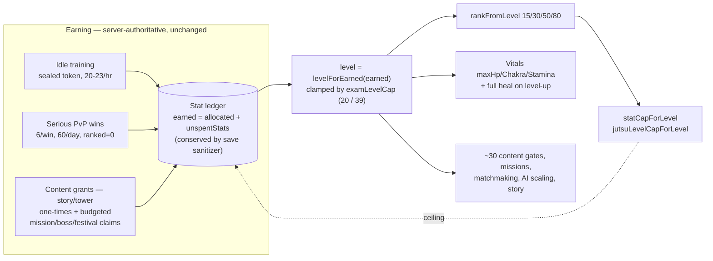

# Leveling Without XP — Design & Migration Map

**Status:** MAP ONLY — no code written. This is the "focused balancing pass" flagged in
`docs/leveling-training-redesign-plan.md`: remove character XP entirely and derive
**level from total stat points earned**. All file:line references verified against
commit `72c40db78` (branch `claude/leveling-without-xp-b0043a`).

**One-sentence version:** `character.level` stays as a field, but instead of being
driven by `gainXp`, it becomes a pure function of the server-conserved stat ledger
(`allocatedStatPoints(stats) + unspentStats`), clamped by the existing exam holds —
so every one of the ~30 systems that *reads* level keeps working untouched, and the
work is confined to the ~30 sites that *write* XP.

---

## 1. Why this works now (and wouldn't have two months ago)

The two-axis redesign (live on main) already moved every stat point onto its own
server-authoritative rails:

- **Training** is direct-to-stat via sealed tokens (`api/training/start.ts` →
  `api/training/complete.ts` → `api/training/_grant.ts:11-21`), 6/22/84/160 pts per
  15m/1h/4h/8h session, 96 starts/day.
- **Combat growth** is serious non-ranked PvP only (`api/pvp/claim-rewards.ts:332-340`
  → `api/_stat-growth.ts:65-100`), 6 pts/win, 60/day cap, ranked pays 0.
- **The ledger is already conserved and server-enforced.** The save sanitizer's
  `preserveStatPointEntitlement` (`api/save/_stat-entitlement.ts:52-55`) computes
  `allocated(stats) + unspentStats` and **rejects any client save that changes the
  sum**. Spending pool points and respec are exact transfers
  (`api/profile/_settlement.ts:52-79`).
- Level's only remaining jobs are: rank bands → caps (`statCapForLevel`,
  `jutsuLevelCapForLevel`), vitals (`maxHp/Chakra/StaminaForLevel` + full heal on
  level-up), and ~30 content/matchmaking gates — **all of which read `level` as an
  integer; none read `xp`** (verified sweep, §6).

So XP today is a *second* progression currency whose only output is that integer.
Removing it collapses progression to one currency — stat points — that is already
conserved, already capped, already audited.

**Security bonus:** the XP system is the last place the client self-grants
progression (`App.tsx:6507` chest `25+rand(30)`, `App.tsx:7123` tablet
`60+rand(50)`, `WorldMap.tsx:2371/2477/2674/2698`, client tower cash-out
`App.tsx:5227`), tolerated via the `+100 XP/save` sanitizer allowance
(`api/save/[name].ts:752-754`). Deleting XP deletes that entire trust surface:
level becomes forge-proof (recomputed server-side from the conserved ledger), and
`MAX_LEVEL_GAIN`, `MAX_XP_PER_MINUTE`, and the XP gains-window plumbing all retire.

---

## 2. Target architecture



The loop `caps → earning → level → caps` is a **ratchet, not a circularity**:
earning raises level, level raises caps, caps make room for more earning. The one
place it can deadlock is if a level threshold exceeds what the previous band's caps
allow you to earn — which is exactly what a naive inversion does (§3), and what the
fitted threshold table prevents.

**Core identity (new canonical helper, both mirrors):**

```
earnedStatPoints(char) = allocatedStatPoints(normalizeStats(char.stats)) + max(0, floor(char.unspentStats))
level(char)            = min( levelForEarned(earnedStatPoints(char)), examLevelCap(char) )
```

- `allocatedStatPoints` already exists on both sides (`lib/stats.ts:68-71`,
  `api/_xp-engine.ts:74-77`).
- A new-character baseline is `allocated 0 + unspentStats 20` → earned 20 → level 1
  (`api/save/_first-save-baseline.ts:35-44`).
- `unspentStats` counts toward earned, so **respec never de-levels** and pool
  points banked while cap-blocked still progress you (matching
  `computeCombatStatGrowth`'s roll-into-pool behavior).

---

## 3. The threshold table (the balance heart of the change)

### Why the existing curve cannot be reused

`statBudgetAtLevel(L) = 20 + round((L−1)/99 × 29,860)` (`lib/stats.ts:147-159`)
inverted as a level curve **walls**:

| Boundary | Naive inverse needs | Band can produce (12 stats to cap + 20) | Verdict |
|---|---|---|---|
| L15 (leave Academy, caps 350) | 4,243 | **4,100** | ❌ unreachable |
| L30 (leave Genin, caps 700) | 8,767 | **8,300** | ❌ unreachable |
| L50 (leave Chunin, caps 1300) | 14,800 | 15,500 | ⚠ 95% completion required |
| L80 (leave Jonin, caps 2100) | 23,848 | 25,100 | ⚠ 95% |
| L100 | 29,880 | 29,900 | ⚠ 100% of every stat |

Worse, a cap-blocked player is a dead account: training past the rank cap grants 0
(`api/training/_grant.ts:14-15` truncates), so the wall is not "slow," it is
"stopped."

### Proposed `LEVEL_EARNED_THRESHOLDS` (fitted to band capacity)

Piecewise-linear between anchors, rounded; single exported table, client + server
mirrored and parity-pinned like the cap tables:

| Anchor | Earned required | % of band capacity | Rationale |
|---|---|---|---|
| L1 | 0 | — | creation baseline (earned 20) is comfortably level 1 |
| L15 → Genin | **2,800** | 68% of 4,100 | reachable with ~8 of 12 stats worked; focused 6-stat builds top off with modest spillover |
| L30 → Chunin | **6,200** | 75% of 8,300 | |
| L50 → Jonin | **11,600** | 75% of 15,500 | |
| L80 → Sp. Jonin | **19,600** | 78% of 25,100 | |
| L100 | **27,500** | 92% of 29,900 | endgame near-completion, but not literal perfection |

Derived exam-hold points: **L20 ≈ 3,935 earned**, **L39 ≈ 8,630 earned**.

`levelForEarned(S)` = largest L with `earnedForLevel(L) ≤ S` (interpolated table
walk; O(bands)). `earnedForLevel` replaces `statBudgetAtLevel` in spirit — see §7
for what happens to the old function.

### Pacing (anchored by owner directive: standard player fully caps in ~90 days)

The anchor cohort is defined, per the owner: **"play the game, do your dailies,
and a little extra."** Concretely: an 8 h overnight training collect plus one
~4 h daytime session (~244 pts), the full daily checklist (45, §4), two or
three serious PvP wins (~15), and the one-time spine (~1,000 pts across
story/tower first-clears) amortizing to ~11/day — **≈ 315 pts/day → full
29,880-point cap in ~93 days.** These are **base rates** (generation 1, no
boosts active); the growth-boost layer (§4.1) is what makes later generations
"way shorter." Milestones for that player, with dedicated/casual around them:

| Milestone | Standard (~320/day) | Dedicated (~400/day) | Casual (~210/day) | Today's XP pace |
|---|---|---|---|---|
| L15 | ~day 9 | ~day 7 | ~day 13 | — |
| L20 (Genin exam) | ~day 12 | ~day 10 | ~day 19 | — |
| L39 (Chunin exam) | ~day 27 | ~day 22 | ~day 41 | — |
| L50 | ~day 36 | ~day 29 | ~day 55 | — |
| L80 | ~day 61 | ~day 49 | ~day 93 | — |
| L90 | ~day 74 | ~day 59 | ~day 112 | **~151 days** |
| L100 | ~day 86 | ~day 69 | ~day 131 | longer |
| **Full 12-stat cap** | **~day 93** | ~day 75 | ~day 142 | — |

Cohort spread stays under ~2× and everyone converges on the same universal
ceiling — faster play buys *sooner*, never *more*. Tuning knobs if the anchor
drifts, in order: checklist size (§4), PvP slice, threshold anchors, and only
last `RATE_PER_HOUR` (it drags everything, and its tiers are already shipped
and parity-pinned). The mid-table (L15–L50) must stay fitted to band capacity
regardless, or walls come back.

The daily-growth structure (§4) is the **second, independent pacing dial**:
active-play growth is a fixed daily checklist (45) plus a PvP slice (18) —
63/day base, on par with the old 60/day PvP-only allowance, and now fillable
by normal play. Folding growth into the dailies deliberately narrows the
casual/dedicated spread, since the checklist is the same size for everyone.
The two dials cleanly separate **idle pace** (training rates) from
**active-play pace** (slice sizes). This replaces XP's old "independent pacing"
role — same knob count, one currency.

### Exam holds carry over cleanly — with one behavior change

Today the XP overflow at a hold is **destroyed** (clamped to `xpNeeded−1`,
`api/_xp-engine.ts:237-239`). Stats can't be destroyed, so under the new model a
held player keeps earning (toward the *held* rank's caps + bankable pool) and
**leaps forward on exam pass** (`level = levelForEarned(earned)`, possibly several
levels, potentially straight into the next hold). This is strictly friendlier than
today and needs no new mechanics — but worth a patch note.

---

## 4. Faucet disposition table (every XP grant site)

Policy (v3, owner direction 2026-07-27): **growth folds into the daily loop.**
The design target, in the owner's words: *doing all the dailies gets you close
to the daily growth cap but not all of it — the rest is PvP's, and story stacks
on top.* Three grant classes:

- **One-time spine grants (outside any budget):** story milestones (~600
  total), Battle Tower floor first-clears, apex first-completion, tutorial
  spar, weekly-boss settlement (weekly receipt). Non-farmable by construction
  (progress-flag / receipt-gated). Story deliberately does **not** compete with
  dailies for budget — a story day is a bonus day, which is the strongest form
  of "leaving room for story."
- **The daily checklist (the dailies slice, target = 45 pts as built):** stat
  grants ride ONLY on claims that are already once-per-day — the 10 hunt + 5
  fetch board dailies at **+3 each** (`FIELD_MISSION_STAT_POINTS`,
  `api/missions/_mission-catalog.ts`). A full clear sums to
  `DAILY_PVE_GROWTH_TARGET = 45` **by construction** — there is no clamp to
  slam into, no "my later dailies paid zero" feel; the existing once-per-day
  claim receipts are the idempotency guard. Profession dailies stay on their
  own profession-XP track (a different namespace, untouched); festival dice add
  small seasonal pool points (+1–5) on top of the target. The checklist grows
  with level as boards unlock (dailies are levelReq-gated); the invariant pins
  the fully-unlocked sum, and early bands lean on training anyway. Values are
  pinned by a test: full-clear sum ∈ target ±10% — **base values; growth
  boosts (§4.1) multiply after.**
- **The PvP slice (18 pts = 3 serious wins × 6):** mechanics unchanged
  (`computeCombatStatGrowth`, auto+pool split, ranked 0, own
  `combat-stat-count` key) — but its daily cap re-cuts **60 → 18** so dailies
  are the bulk, per the directive. Heavy-PvP players lose ~42/day of growth vs
  today; flagged in §11.

**Unlimited-repeat content pays ryo only** — repeatable combat-mission slots,
arena AI wins, Endless Tower, tower assists, explore/chests, Hollow Gate
(their old XP lines fold into ryo at ~0.75:1). That is the farm-bound: growth
lives only on things you can do once (per day, or ever). Spars and plain
practice stay at zero (standing owner directive). Daily base maximum = 45 + 18
= 63 (on par with the old 60/day allowance), plus whatever one-times you
unlocked that day, all multiplied by active growth boosts (§4.1). Surface it
as a split meter — **"Daily Growth 33/45 · Combat 12/18"** — so progress reads
as bars you fill. Non-combat claims grant **pool-only** (`unspentStats +=`);
the auto-grow-used-stats split stays PvP-only.

### 4.1 Growth boosts — every XP-bonus in the game becomes a stat-gain bonus

Owner directive: convert all "XP increase" mechanics into stat-growth
multipliers, so players in a developed world ("generation 2") cap **much**
faster than the founders did. Boosts multiply **on top of** slice accounting —
the ledger counts base points, payout = base × boost — so they compress
calendar time without distorting the checklist's structure, and they never
raise the 2500 ceiling, only how fast you reach it (the same
convenience-not-power rule the original training-bonus design used).

| XP-boost today | Becomes |
|---|---|
| Town Hall training XP bonus (`getTrainingXpBonus()` — village upgrades + clan/elder sources), currently displayed but **not actually granted** (`api/training/_session.ts:77` seals `bonusPct = 0` while `Training.tsx:238` shows the boosted figure) | **Training stat-rate bonus, actually sealed:** `training/start` computes `bonusPct` server-side from server-readable village/clan/elder state and seals it into the token. Fixes the pre-existing display/grant mismatch. |
| Elder focus `training` +10% XP (`api/_xp-engine.ts:159-166`) | +10% training stat rate, folded into the sealed `bonusPct`. |
| Mission XP boosts — `boostAmount(xp, townHallBonus + huntRankBonus)` (`api/missions/claim-mission.ts:391`) | Same `boostAmount`, applied to the **checklist grants** (base +4 → boosted). |
| Swift trait +25% PvP XP (`computePvpWinGains`) | +25% PvP stat growth per win (base 6 → 7–8), trait read server-side as today. |
| Death's Gate sector 99 ×2 XP | ×2 PvP stat growth for wins in sector 99. |
| `CHARACTER_XP_GAIN_MULTIPLIER` (client+server constant, parity-pinned = 1) | **Retired.** Successor: **`STAT_GAIN_MULTIPLIER` — a server-env era dial** (default 1) applied at every server grant site (training, checklist, PvP). Server-only: all grants are server-side now, so no client constant, no cross-build pin, flippable on Railway without a rebuild. UI shows a **"Growth Surge ×N"** badge when the server reports it active — the designed successor of the old "Testing XP" badge. |
| Aura "Jutsu XP +N%", pet/profession/clan XP boosts | Untouched — different XP namespaces. |

**The two-generation effect, quantified (full cap, standard profile):**

| Cohort | Aggregate boost | Days to full cap |
|---|---|---|
| Gen 1 — launch, undeveloped villages | ~×1.0 | **~93** |
| Gen 2 — mature village (Town Hall + doctrine + elder, ~+25–30%) | ~×1.27 | **~73** |
| Gen 2 + era dial ×1.5 | ~×1.9 | **~49** |

Guardrail: pin a **maximum aggregate boost** (proposal: ×2.5 combined, era dial
included) in shared config so stacking can never run away, and write the
applied multiplier into the training/claim audit trail.

### Server faucets (all route through `api/_xp-engine.ts` `gainXp`)

| Site | Today | Disposition |
|---|---|---|
| `api/training/complete.ts:107` (sealed tier XP 20/70/220/375) | training XP trickle | **Delete.** Training already grants the stat; the trickle's only job was leveling. Remove `xp` from tier config + `_training-parity.test.ts:18` pin. |
| `api/pvp/claim-rewards.ts:313` + `api/player/sleeper-kill.ts:246-250` (`creditPvpWinBase`, 100/125×2) | PvP win XP | **Delete XP; keep ryo.** Stat growth (the real reward) already flows; its daily cap re-cuts **60 → 18** (the PvP slice, §4), and the Swift/Death's-Gate XP multipliers move onto it (§4.1). `PvpWinBaseSummary` drops `xp/level` fields → client mirror `applyServerBaseReward` (`lib/progression.ts:83-101`) follows. |
| `api/missions/claim-mission.ts:391` (catalog 15–700; apex 3000) | mission XP | **Once-per-day claims join the daily checklist:** field/hunt dailies (already once-each/day) **+4 each**, profession dailies **+2–3 each**, tuned so a full clear ≈ 50 base — then multiplied by the same `boostAmount` town-hall/hunt-rank bonuses that used to boost mission XP (§4.1). **Repeatable combat-mission slots → ryo only** (they are the unlimited-repeat channel). Apex first-completion: one-time **+25**, outside. |
| `api/missions/report-ai-fight.ts:108` (sealed ≤150, 50/day full, 100/day hard) | AI-fight XP | **Delete XP; keep ryo + stamina** (retires the flat-100 double-dip oddity + the `_ai-fight-reward.ts` XP-decay machinery). Resolved by the v3 rule: raw AI wins are unlimited-repeat → **ryo only**; the once-per-day hunt/field *claim* is where that playtime's growth lands. Plain practice stays zero. |
| `api/story/_settle.ts:44` (tutorial spar 60) | teaching reward | **Convert to +20 pool points** (one-time, non-farmable, already gated) — teaches the USER STATS panel, replacing the "XP bar moved" teach. |
| `api/story/_settle.ts:74` (milestone table 120→10,000) | story chapter XP | **One-time pool grants, outside the daily budget** (table ÷ ~40 → 3→250 pts/chapter, **~600 total** across the story) + keep ryo. Server-tracked by `storyProgress`, non-farmable. |
| `api/world/_explore.ts:17` (20+, 150/day) + `api/world/_chest.ts:35` (50+, 23/day) | exploration XP | **Delete XP; keep/raise ryo slightly.** Exploration already pays discovery + loot. |
| `api/towers/_tower-store.ts:163,338` (floor first-clears 150–2500; assists) | Battle Tower XP | **Floor first-clears → one-time pool grants outside the budget** (XP table ÷ ~40 → ~4–60 pts/floor; already NX-receipt-gated). Assists (repeatable, daily-capped) → small budgeted grant or ryo-only (owner call). |
| `api/endless/_run.ts:47` (banked XP, softcap 450+60L) | Endless Tower banked XP | **Convert banked XP → banked ryo** at ~0.75:1 at wave-reward time; delete the entire daily-XP-softcap subsystem (`dailyTowerXp`, `towerDailyXpSoftCap`, `creditTowerXpWithSoftCap`). Risk/banking tension is preserved via ryo. Deliberately **not** a stat faucet — it's an infinite-repeat mode, and keeping it ryo-only avoids rebuilding the softcap subsystem for stats. |
| `api/hollow-gate/combat-settle.ts:172` (140/220/600×depth) + `_locked-door.ts:19` | Hollow Gate XP | **Delete XP; keep existing loot/ryo lines.** |
| `api/weekly-boss.ts:387` | weekly boss XP share | **Once-per-week pool grant, outside the daily budget** (~+10 pts per settlement, NX-receipt-gated — a weekly event shouldn't eat a day's checklist) + keep the ryo share. |
| `api/festival/sunscar.ts:75` (dice 10–75) | festival XP outcomes | **Joins the daily checklist** (+1/+1/+2/+2/+5 mirroring the table, counted inside the ~50 target) — dice are already daily-capped and cost ryo. |

### Client grant sites

| Site | Disposition |
|---|---|
| `lib/claim-mission.ts:89`, Training.tsx, Arena.tsx | Already server-mirrors — they follow the server response; nothing to do beyond type updates. Keep the rolling-deploy fallback graceful (fallback becomes "apply server character or no-op," never a local level bump). |
| `App.tsx:6507, 7123` (Hollow Gate client-RNG XP), `App.tsx:6770/6715` (locked door), `WorldMap.tsx:2371, 2477, 2674, 2698` (chest/explore/creator events), `App.tsx:5425, 5813` (creator/story events), `App.tsx:5227` (tower cash-out) | **Delete the `gainXp` calls** (convert to their ryo/loot lines). These are the client-trust holes; their XP would be discarded by the frozen sanitizer anyway (§5). Creator-event `xpReward` fields: keep accepting in content schema, ignore or map to ryo — don't break existing creator content. |
| `components/LeftProfileCard.tsx:212-219` ("⬆️ Level Up!" button, `gainXp(char, 0)`) | **Delete** — level-ups are automatic on earn. Replace with the earned-progress bar (§6). |

**Deliberately untouched XP namespaces:** jutsu mastery XP (`lib/jutsu-scaling.ts` —
zero shared code with character XP, verified), pet XP, profession XP, clan XP,
Vanguard profession XP.

---

## 5. Server authority & sanitizer changes (`api/save/[name].ts`)

| Today | After |
|---|---|
| `level` clamped to +5/save (`:748-751`), `xp` to +100/save (`:752-754`), `MAX_XP_PER_MINUTE` window (`:273, :2406-2410`) | **Server recomputes `level` from the ledger on every save write** (`level = min(levelForEarned(earned), examLevelCap)`); client-supplied `level`/`xp` ignored. Delete the XP clamp plumbing. Level forgery becomes impossible rather than rate-limited. |
| `xp` lives on the save | **Freeze:** field stays on stored saves (rollback insurance until the wipe), always forced from stored, never displayed. Drop at wipe. |
| Stat ledger conserved by `preserveStatPointEntitlement` | Unchanged — it is now the *level* anti-cheat too. Keep `totalStatsTrained` server-owned (`:881`) as the cross-check ledger. |
| Exam floors on `examsPassed` (`:1263-1313`) | Unchanged. |
| Vitals set by `gainXp` on level-up (full heal) | New `applyDerivedLevel(char)` helper (both mirrors) does: recompute level → if raised, set `rankTitle` + `maxHp/Chakra/Stamina` + full refill (verbatim from today's loop, `api/_xp-engine.ts:215-241`). Called from: training/complete, claim-rewards, sleeper-kill, story settle, migration reconcile, save-write sanitize. |

### Ledger leaks to plug (prerequisite fixes, from the conservation audit)

1. **Training overflow at rank cap is destroyed** (`api/training/_grant.ts:14-15`).
   Under stat-leveling that's destroyed *level progress*. **Fix: roll overflow into
   `unspentStats`** (mirror `computeCombatStatGrowth`'s pattern,
   `api/_stat-growth.ts:87-98`). This also fixes respec under-refund (#2) by
   construction.
2. Respec refunds post-truncation values (`api/profile/_settlement.ts:57-62`) —
   resolved by #1.
3. **Admin bypass** (`?signal=1` skips the sanitizer, `:2150, 2159-2163`; admin
   `maxedStats()` accounts, `App.tsx:779-789, 1386-1387`): admin accounts derive to
   L100 — acceptable, but **exclude admin-flagged saves from the earned/level
   leaderboards**, and admin "set level" (`AdminPanel.tsx:2063-2079`) becomes
   "grant/remove pool points" (level is no longer directly settable). |
4. `normalizeCharacter` defaults missing `unspentStats` to 20 (`App.tsx:1072`) —
   matches the creation baseline; harmless, keep.
5. The `<12 stat keys` bootstrap branch (`api/save/[name].ts:873-875`) is
   unconserved — tighten to intersect with baseline, or accept until the wipe
   (flagged).
6. Entitlement floors stats at 10 vs `capStat` floor 0 (`_stat-entitlement.ts:12`
   vs `lib/stats.ts:35-37`) — admin-only reachable; align floors while in there.

---

## 6. The nine XP readers, and the UI plan

Level *readers* (~30 systems, 100+ sites: caps, exams, missions, matchmaking,
Academy PvP protection, AI scaling, story gates, professions L13, Legacy L50,
Anbu/Hollow-Gate L100, patch notes L5, war tax, achievements…) — **all keep
working untouched** because `level` remains a field. The full sweep found **zero
gates that read `xp`**. The nine that do read XP:

| Reader | Disposition |
|---|---|
| `gainXp` engines + `progressAfterXp` + `statPointsEarnedFromXp` (`App.tsx:761-829`, `lib/stats.ts:174-183`, `api/_xp-engine.ts:209-244`) | Replaced by `earnedStatPoints`/`levelForEarned`/`applyDerivedLevel`. Net-negative App.tsx lines → **ratchet `App.size.test.ts` `MAX_LINES` down** after. |
| `statPointBudgetForProgress` (`lib/stats.ts:165-171` + server twin) | Delete (dead after ProgressionPanel refit). |
| **"Total XP Earned" leaderboard** (`api/player/_public-index.ts:107,148,211,272,479`; `PublicLeaderboard.tsx`; `HallOfLegends.tsx:203,320-324`) | **Swap metric to `earnedStatPoints`** — "Most Powerful / Total Stat Points Earned." Same board plumbing, new value + label. Exclude admin saves. |
| **Combat HUD `power={character.xp}`** (`Arena.tsx:5730`, `PvpBattleScreen.tsx:1414,2062` → `CombatSideHud.tsx:102-207`) | **Feed `earnedStatPoints` instead** — a *better* power number than XP ever was. |
| Save-route XP clamps (`api/save/[name].ts:748-759, 273`) | Deleted/frozen per §5. |
| `normalizeCharacter` xp clamp (`App.tsx:1033-1034`) | Level recomputed via ledger; xp line deleted. |
| Endless-tower XP softcap system (`lib/endless-tower.ts:36-80`) | Deleted with the banked-XP→ryo conversion (§4). |

### UI surfaces (~70 sites, 2 chokepoints)

- **Progress bars → earned-progress bars.** `LeftProfileCard.tsx:197-221`,
  `MobileNav.tsx:75-77,154-155`, `ProgressionPanel.tsx:30-70`, `Profile.tsx:389-405`
  switch from `xp / xpNeeded(level)` to
  `(earned − earnedForLevel(level)) / (earnedForLevel(level+1) − earnedForLevel(level))`
  with copy "N pts to Level L+1 — earn by training and serious PvP." ProgressionPanel's
  false "Each level grants ~301 stat points" line (`:41,92`) becomes the honest
  inverse: "Level L unlocks at N total points earned." The panel's
  `earned = spent + unspent` arithmetic is *already* the new model.
- **Toast chokepoints:** `rewardSummary` (`lib/currency.ts:79-80`) and
  `displayCharacterXpGain` (`lib/progression.ts:32`) — drop the XP part in these
  two places and ~40 call sites follow. Then sweep the ~15 hand-rolled `+N XP`
  strings (Arena victory `:3146-3154`, PvP summary `:1753-1757`, Hollow Gate
  modals, Logbook, WeeklyBossArena, SunscarFestival, StoryBoss, tower lobby).
- **Copy pass:** "XP hold" → "level hold" (`lib/logbook-objectives.ts`,
  `lib/daily-briefing-core.ts:111-132`, Logbook exam banner `:285`), Training
  screen blurbs (`Training.tsx:5,65,86,172-177,236-256` — also delete the dead
  "Testing XP" badges), guides (`data/guides.ts` ×7), `data/patch-notes.ts` (+ a
  new player-facing patch note), `data/admin-icons.ts:12` XP reward icon label.
- **CSS retire:** `.left-xp-*` (14-menu-panels…css:509-536), `.mobile-xp-bar-*`
  (23-mobile-shell.css:652-661), `.prog-bar-*` fill variants (ProgressionPanel.css).
- **Celebration:** level-ups now fire inside server-response application — trigger
  the existing level-up/rank-up UX off a level diff in `updateCharacter`
  (RankUpCelebration's localStorage-diff pattern already does this for ranks).

---

## 7. AI parity decision (recommend: freeze)

`aiStatsForLevel` distributes `statBudgetAtLevel(level)` (`lib/ai-stats.ts:81-86`),
and `ai-stats.test.ts:14-33` pins that coupling. Two options:

- **A (recommended): freeze AI on the old linear curve.** Rename it
  `aiStatBudgetForLevel` (same numbers, now AI-only). **Zero PvE balance change** —
  every enemy keeps exactly today's stats. Honors "don't change combat formulas
  unless asked."
- B: re-point AI at `earnedForLevel` so a level-L AI matches a *typical* level-L
  player's earned total. More honest, but globally re-tunes PvE difficulty
  (e.g. L50 AI loses ~22% of its stats) — do NOT bundle this into the migration;
  it's its own balance pass if ever.

---

## 8. Migration (one-time reconcile, lazy)

Pre-launch with a wipe pending, so generosity beats precision:

```
onLoad/onSaveWrite (server, once per save — flag `levelLedgerMigrated`):
  earned = earnedStatPoints(char)
  need   = earnedForLevel(char.level)          // stored level, already exam-clamped
  if (earned < need) char.unspentStats += need − earned    // top-up: nobody de-levels
  char.level = min(levelForEarned(earnedStatPoints(char)), examLevelCap(char))
  applyDerivedLevel(char)                       // rankTitle + vitals
```

- **Nobody de-levels; nobody loses unlocks.** Under-statted testers get a one-time
  pool infusion (precedent: the economy-redesign stat top-up, owner-accepted,
  patch-noted). Over-trained low-levels level *up* on first touch.
- Admin `maxedStats()` accounts derive to L100 (they already were).
- Lazy migration on save touch is sufficient pre-wipe; an optional admin sweep
  endpoint can force-migrate all saves for leaderboard consistency.
- `xp` field: frozen, retained until the wipe (rollback = revert the deploy; saves
  still carry xp).

**Rollout stance:** single cutover on a branch, adversarial-reviewed, no runtime
dual-path flag. A live formula flag would double the parity surface (client+server
× two engines) for a pre-launch game with a revert path. This deviates from the
usual "ship ON with kill switch" pattern deliberately — flagging it.

---

## 9. Test & verification plan

| Guard | Action |
|---|---|
| `api/_cross-build-parity.test.ts:145-154` source-text pins (`6 * level * level`, budget formula) | Replace with pins on the `LEVEL_EARNED_THRESHOLDS` table + `earnedForLevel` source text (both mirrors). |
| `api/_xp-engine.test.ts` (3,000-case `gainXp` sweep + golden anchors) | Rewrite as an `earned→level` sweep: all levels × earned values × exam flags, server vs client replica `deepEqual`; new golden anchors (earned 20→L1; 2,800→L15; 3,934→L19 vs 3,935→L20-held; exam-pass leap case; 27,500→L100). |
| `lib/stats.test.ts:17-65` (xpNeeded/budget/progress anchors) | Replace with threshold anchors + monotonicity + `levelForEarned(earnedForLevel(L)) === L`. **Add the reachability invariant:** `earnedForLevel(bandBoundary) ≤ 0.8 × bandCapacity` for every band — the anti-wall guard. |
| `lib/stats.test.ts` pacing bound | Rewrite: dedicated 340/day → L90 within [55, 90] days (or owner's chosen window). |
| New ledger tests | earned conservation under spend/respec/growth/training-overflow; overflow-rolls-into-pool; migration top-up (no de-level, exam clamp holds); `applyDerivedLevel` full-heal parity. Plus the **daily-checklist invariant**: sum of all once-per-day grants over the live daily catalog ∈ `DAILY_PVE_GROWTH_TARGET` ±10% — fails the build if someone adds a daily without re-tuning the slice (pins **base** sums; boosts multiply after). Boost tests: sealed `bonusPct` is server-derived, the aggregate-boost ceiling holds, and `STAT_GAIN_MULTIPLIER` defaults to 1. |
| `_training-parity.test.ts:18` per-tier `xp` pin | Drop the xp column both sides. |
| `lib/currency.test.ts:7,16` `"+10 XP"` strings | Update to the XP-less format. |
| `lib/endless-tower.test.ts` XP-softcap suites | Delete with the subsystem; new banked-ryo tests. |
| `lib/logbook-objectives.test.ts:130`, `ai-stats.test.ts` pin, `rank-progression`, `_stat-growth`, exam/eligibility tests | Update copy/pin targets; behavior unchanged. |
| Sim | Update `scripts/` pacing sim to the earned model; re-run the day-to-milestone table in §3 from code. |
| Ship gates | Full root `npm run build` (includes sizecheck — check the **margin**, CI adds Sentry), `npm test` from root, client `npm run lint`, App.tsx ratchet lowered, no `dist/` commit. |

---

## 10. Phase plan

Sequencing note: land/rebase the uncommitted launch-audit fixes from the other
worktree first — this touches the same engine files.

- **Phase 0 — Sign-offs (owner):** threshold table + pacing (§3), faucet
  conversions (§4, esp. story-milestone pool grants vs ryo-only), leaderboard swap,
  AI freeze (§7), no-kill-switch stance (§8). *This document is the ask.*
- **Phase 1 — Core curve (no behavior change yet):** `LEVEL_EARNED_THRESHOLDS` +
  `earnedForLevel`/`levelForEarned`/`earnedStatPoints`/`applyDerivedLevel` in
  `lib/stats.ts` + `api/_xp-engine.ts` (keep file names — everything imports them);
  freeze `aiStatBudgetForLevel`; training-overflow→pool fix; new tests + parity
  pins alongside the old ones.
- **Phase 2 — Server cutover:** `gainXp` internals → derived-level engine; the 12
  server faucet dispositions; sanitizer changes (level recompute, xp freeze, clamp
  deletion); leaderboard metric; migration reconcile + flag.
- **Phase 3 — Client cutover:** delete client `gainXp` sites; bars/HUD/toasts/copy
  per §6; tower banked-ryo; celebrations; CSS retire; App ratchet down.
- **Phase 4 — Verify & ship:** §9 suite green, pacing sim output attached,
  adversarial review pass (engine + sanitizer + migration), patch notes
  (`data/patch-notes.ts` + docs), single merge to main, Railway self-builds.
- **Post-soak cleanup (after wipe):** drop `xp`/`dailyTowerXp` from types + stored
  saves, delete frozen sanitizer pass-throughs, remove migration flag.

---

## 11. Decision list (everything needing an owner call)

1. **Pacing: RESOLVED by owner directive** — the standard "dailies + a little
   extra" player fully caps in ~90 days (current fit: ~93, §3). Remaining
   confirmation: the standard-profile definition the fit assumes (~12 h
   effective training coverage/day). If "normal" should assume less training,
   the checklist grows to compensate.
2. **Slice sizes (as built):** dailies 45 / PvP 18 (base total 63, on par with
   today's 60). Consequence stands: heavy-PvP players' stat growth drops
   **60 → 18/day** — the cost of "dailies are the bulk." Confirm, or re-cut.
   (§3, §4)
3. **Per-claim numbers:** hunt/field +3–4, profession dailies +2–3, dice +1–5,
   story ~600 total, tower first-clears ~4–60/floor, weekly boss +10 — accept
   the §4 defaults (final values tuned against the live daily catalog and
   pinned by the full-clear ≈ target ±10% test) or set exact numbers?
4. **Leaderboard:** swap "Total XP Earned" → "Total Stat Points Earned"
   (recommended) or retire the board?
5. **AI curve freeze** (recommended) vs re-point at the new curve? (§7)
6. **No runtime kill switch** (single cutover + revert path) — confirm the
   deviation from ship-ON-with-kill-switch. (§8)
7. **Growth boosts: RESOLVED by owner directive** — every XP-boost converts to
   a stat-gain boost (§4.1: Town Hall + elder focus fold into the sealed
   training `bonusPct`; mission boosts onto the checklist; Swift/Death's Gate
   onto PvP growth; the retired global multiplier succeeded by the server-env
   `STAT_GAIN_MULTIPLIER` era dial). Remaining calls: the aggregate-boost
   ceiling (×2.5 proposed) and the era dial's launch default (1).
8. **Tutorial spar reward:** +20 pool points (recommended) or ryo?

## 12. Risks

- **Pacing shock** (~2× faster to high level) — the §3 table is the mitigation;
  it's a deliberate dial, not a side effect.
- **Reward-feel:** largely solved by the §4 daily checklist — the once-per-day
  claims show "+N stat pts" where they showed "+N XP", and the sum is designed
  to land, not clamp. Repeatable grinds are ryo-only by rule (legible, not
  broken). The split meter ("Daily Growth 32/40 · Combat 12/18") makes the
  structure visible.
- **Budget-key contention: mostly designed away in v3** — checklist grants are
  guarded by their existing once-per-day claim receipts (no shared counter
  needed), and only the PvP slice keeps the `combat-stat-count` key. Any
  counter that does end up shared stays under `withKvLock { failClosed: true }`.
- **Boost stacking:** converted bonuses now compound on real power-growth speed.
  Guards: the aggregate-boost ceiling (§4.1), server-derived-only `bonusPct`
  (never client-supplied), the applied multiplier written to the audit trail,
  and telemetry watching gen-2 pace against the ~73-day projection.
- **Exam-hold leap** (banked earned → multi-level jump on exam pass) — intended,
  patch-noted.
- **Admin accounts** derive to L100 and pollute earned leaderboards if not
  excluded (§5.3).
- **Rolling deploy window:** old clients self-granting XP against a new server is
  harmless (xp frozen, discarded); new clients against an old server must keep the
  graceful fallback (apply server character verbatim, never local-level).
- **Concurrent worktrees:** other sessions' uncommitted work on `App.tsx` /
  `_xp-engine.ts` will conflict — coordinate before Phase 2/3.
